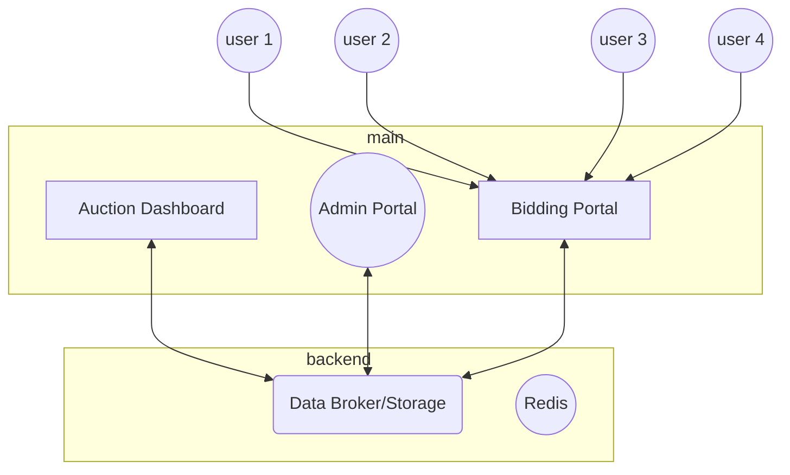

# sAuction

> Smart Auctions Portal Flowchart

## GUIDE To Use (sAuctions)

- Bidding Portal - https://biddings.streamlit.app/

Step 1 : Enter your login code to get access to your Teams Bidding Portal
Step 2 : Enter your Bid & start Bidding!

- Auction Dashboard Portal - https://sauction.streamlit.app/

> File format

- dashboard.py - auction status & live dashboard
  - pages/admin.py - admin settings panel
- bidding.py - team portal for bidding - seperate [repo](https://github.com/hirawatt/bidding)

> Data required

- 

> Glossary

- lb - last bid
- 